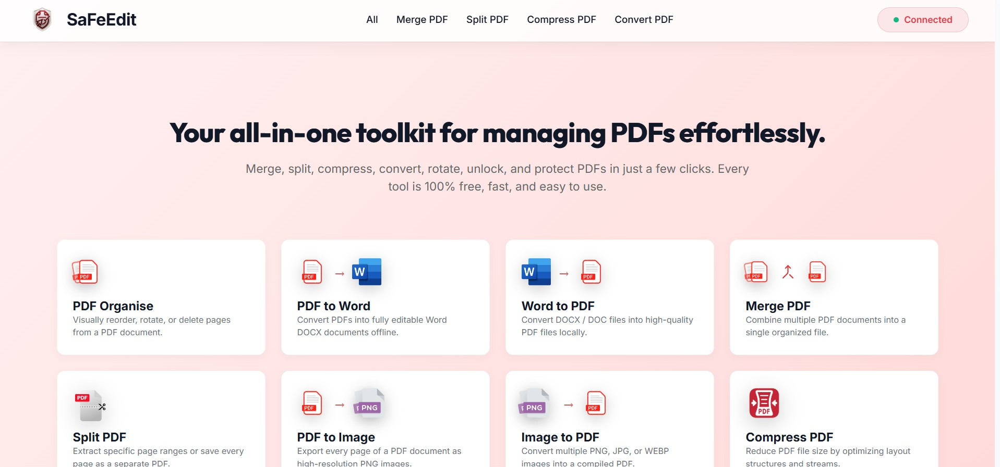
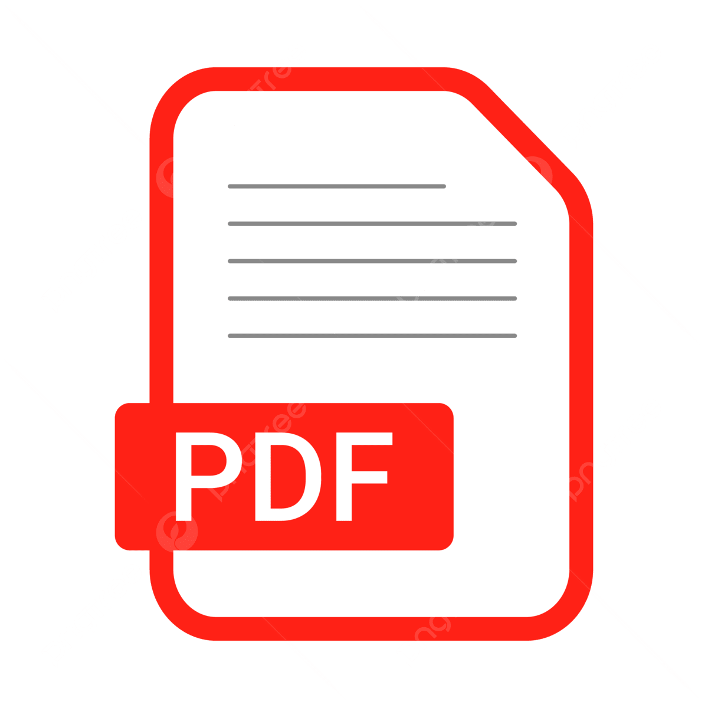
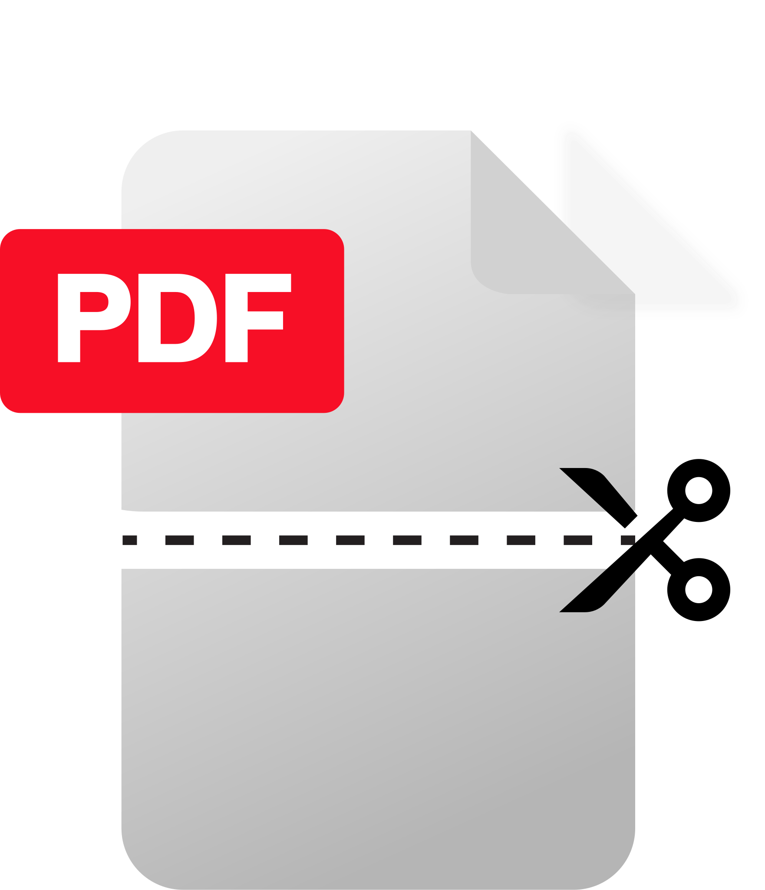
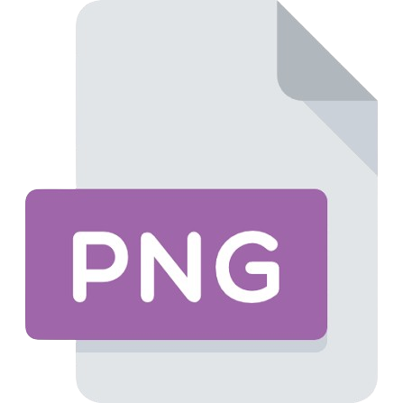
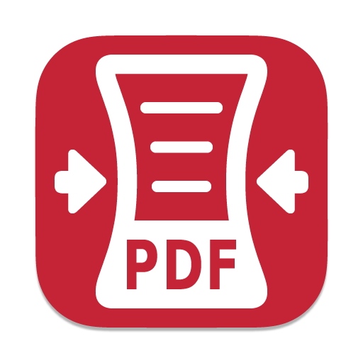

  
  <h1>SaFeEdit Desktop</h1>
  
<strong>Your all-in-one, privacy-first toolkit for managing PDFs effortlessly.</strong>

  

## ✨ Overview

**SaFeEdit** is a premium, local-first utility built to perform complex PDF, Word, and Image operations entirely on your local machine. 

Because privacy and security are paramount, SaFeEdit acts as a standalone offline desktop application. Your sensitive documents are processed strictly offline and **never** uploaded to any external servers or the cloud.

---

## 📦 How to Download & Install

You can install SaFeEdit on any modern Windows computer with a single file.

1. Go to the [Releases Page](../../releases) of this repository.
2. Download the latest **`SaFeEdit_Setup.exe`** file.
3. Double click the `.exe` file to run the installer.
4. Launch SaFeEdit from your Desktop or Start Menu!

### ⚠️ System Requirements
*   **Operating System:** Windows 10 or Windows 11.
*   **WebView2 Runtime:** Microsoft Edge WebView2 is required to render the application window (this is pre-installed on almost all modern Windows machines).
*   **Microsoft Word:** Only required if you intend to use the specific "Word to PDF" feature, as the engine securely uses your local Microsoft Office installation to perform the conversion offline.

---

## 🚀 Key Features

*    **PDF Organise**: A powerful visual page editor. Drag-and-drop to reorder pages, rotate them, delete specific pages, and preview full-size pages with our stunning lightbox modal.
*    **PDF to Word**: Convert PDFs into fully editable Word (`.docx`) documents offline with accurate layout reconstruction.
*    **Word to PDF**: Convert DOCX / DOC files into crisp PDF documents.
*    **Merge PDF**: Merge multiple PDF files into one single document. Easily drag to reorder files in the merge queue.
*    **Split PDF**: Split a PDF by extracting specific page ranges (e.g., `1-3, 5, 8-12`) or extract all pages as individual PDFs zipped together.
*    **PDF to Image**: Render all pages of a PDF as high-resolution PNG images, compiled into a ZIP.
*    **Image to PDF**: Compile PNG, JPG, or WEBP images into a beautifully unified PDF document.
*    **Compress PDF**: Optimize structures and streams to significantly reduce PDF file size without sacrificing quality.
*    **Protect PDF**: Secure your PDFs with strong password encryption.
*    **Unlock PDF**: Remove encryption from authorized PDFs quickly.

---

## 🛡️ Security & Data Privacy

*   **Offline-First**: All data is read, processed, and written directly to memory locally. No data ever leaves your network.
*   **No Telemetry**: Absolutely no tracking cookies, analytics, or external API dependencies.

---

  
<i>Built with privacy, speed, and beautiful design in mind.</i>

  <b>Made with ❤️ by Anuj</b>

